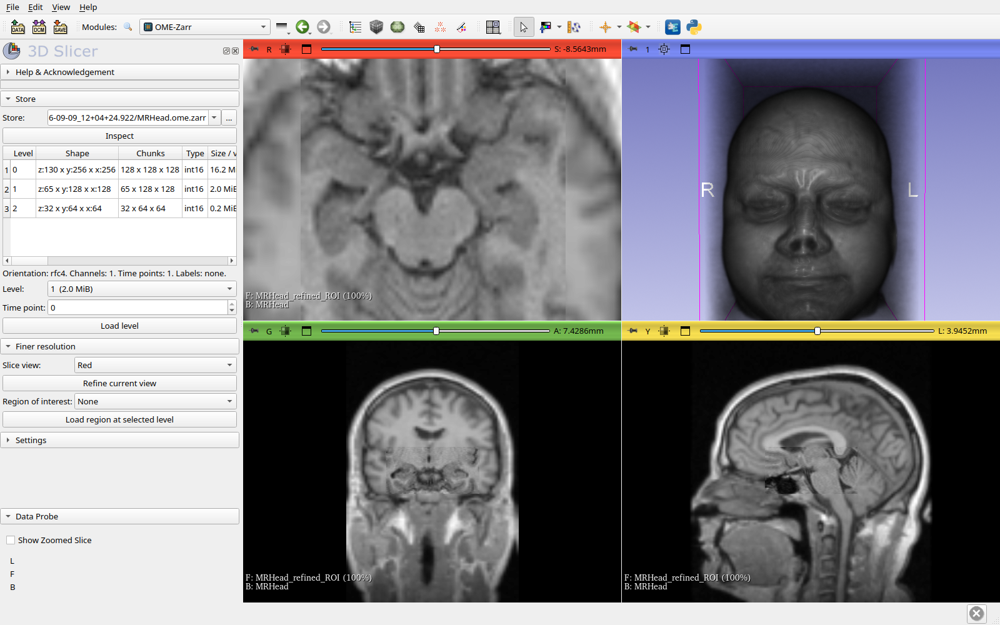

# SlicerOMEZarr

[3D Slicer](https://slicer.org) extension that opens and saves
[OME-Zarr](https://ngff.openmicroscopy.org/) (OME-NGFF) images.
Reading and writing go through [ngff-zarr](https://github.com/fideus-labs/ngff-zarr).

I like working in Slicer, and until now I had to convert every mouse-brain
OME-Zarr dataset to NIfTI just to look at it. This extension removes that step.



## Usage

* Drag an `.ome.zarr` directory onto the Slicer window and pick
  "Load OME-Zarr image".
* `File → Add Data` and select the store's `zarr.json`.
* `File → Save`, choose the "OME-Zarr image" format for a scalar or label map
  volume. Saving a label map into `<image>.ome.zarr/labels/<name>` registers
  it as a label of that image.
* The **OME-Zarr** module lists the resolution levels of a store, loads a
  chosen level, refines what a slice view shows, or loads the region under a
  Markups ROI.
* From Python:

  ```python
  slicer.util.loadNodeFromFile("/data/brain.ome.zarr", "OMEZarr", {"level": 1})
  slicer.util.loadNodeFromFile("https://host/brain.ome.zarr", "OMEZarr")
  ```

The `ngff-zarr[remote]` Python package is installed into Slicer's Python on
first use.

## What works

* **Multiscales**: the finest level whose volumes fit the memory budget is
  loaded. The budget defaults to a quarter of the free RAM and can be fixed in
  the module settings. A message says which level was chosen.
* **Refine current view**: reloads the block shown by a slice view at the
  finest level that fits the budget, reading only the chunks it needs, and
  overlays it on the coarse volume. It can run automatically each time the
  view stops moving. Region-of-interest loading does the same for a Markups
  ROI.
* **Labels**: the `labels` groups of a store load as label map volumes with
  the colours and names of their `image-label` metadata. A label store can
  also be dropped on its own.
* **Time series**: the `t` axis loads as a Sequence with a browser, or as a
  single time point.
* **Axes** `t`, `c`, `z`, `y`, `x` in any order. Channels become separate
  volumes named, coloured and windowed from the OMERO metadata. 2D images are
  loaded as single-slice volumes.
* **Geometry**: spacing and origin are converted from the axis units to
  millimetres. RFC-4 anatomical orientation becomes the IJK→RAS direction.
  Without RFC-4 metadata the axes are assumed LPS (the ngff-zarr and ITK
  convention) or RAS, per the module settings, and the load log says so.
* **Display units**: optionally shows lengths in the store's unit (µm, nm).
* **Writing**: scalar volumes, label maps and segmentations as multiscale
  OME-Zarr, with RFC-4 orientation from the IJK→RAS matrix and `image-label`
  names and colours from the colour table or the segments.
* **Stores**: local directories, `.ozx` files, `https://` and `s3://`.
* **Progress and cancel** while reading.

## Still to do

* `Add Data → Choose Directory to Add` lists the chunk files instead of the
  store, and `slicer.util.saveNode` ignores a requested file type. Both need
  changes in Slicer core (tracked in issue #1); use drag-and-drop, the
  `zarr.json` file, or the save dialog meanwhile.
* Writing to remote stores (ngff-zarr writes local directories only).
* Loading labels as Segmentation nodes rather than label maps.
* Submission to the Extensions Index once the repository is public.

## Development

```bash
Slicer --additional-module-paths /path/to/SlicerOMEZarr/OMEZarr
Testing/run_headless_test.sh /path/to/Slicer                       # module self-test under Xvfb
OMEZARR_TEST_REMOTE=1 Testing/run_headless_test.sh /path/to/Slicer # also test an IDR HTTPS store
```

The same self-test runs in GitHub Actions against the latest stable Slicer on
Linux; the macOS and Windows jobs are informational.
