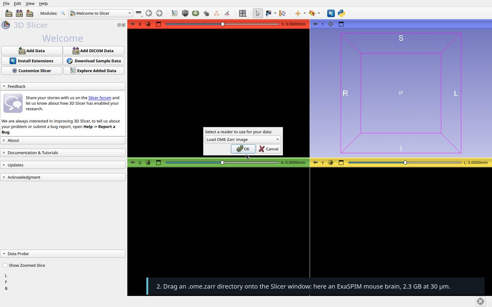
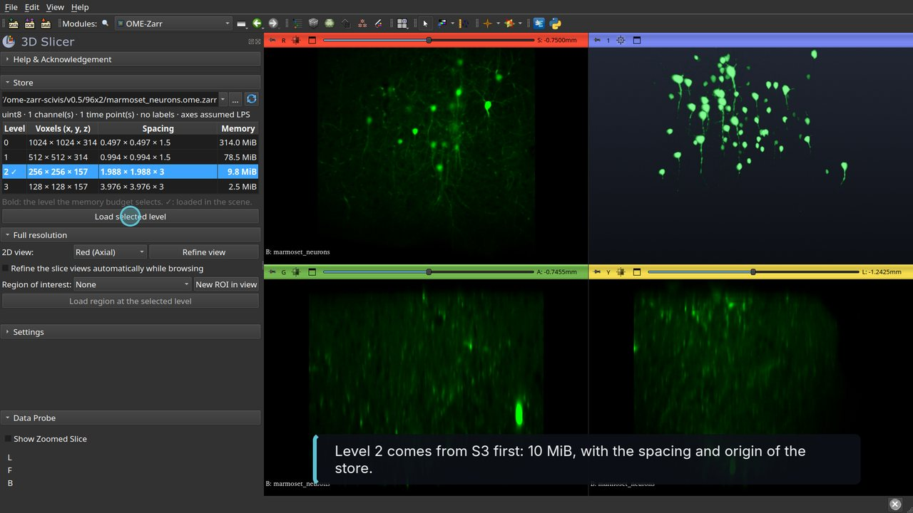
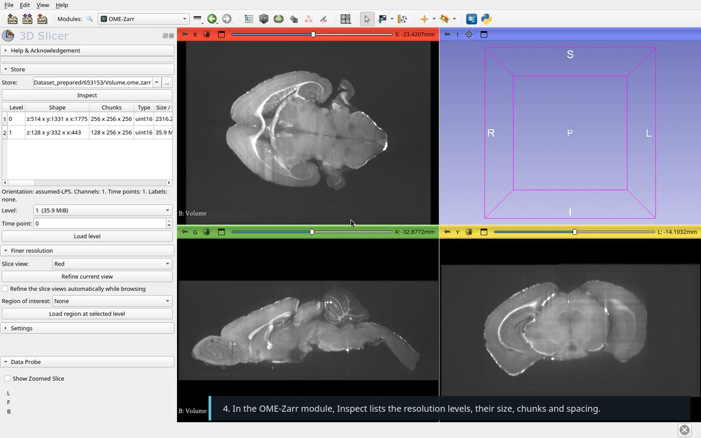
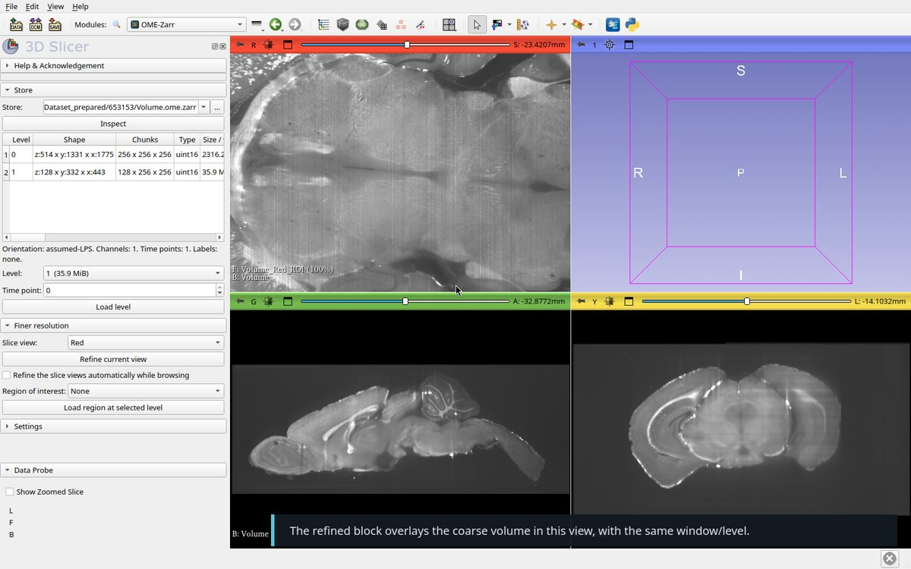
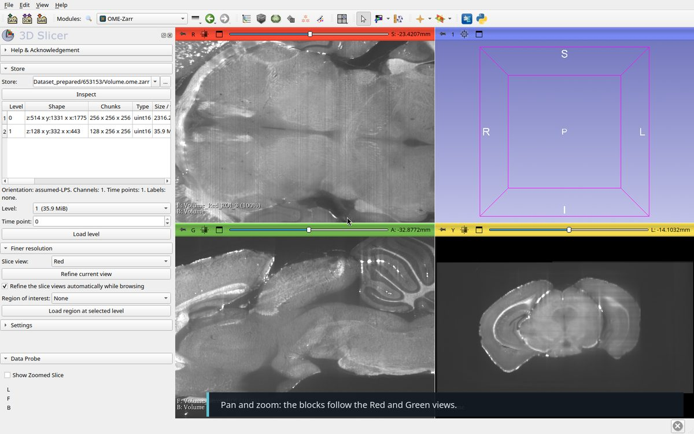
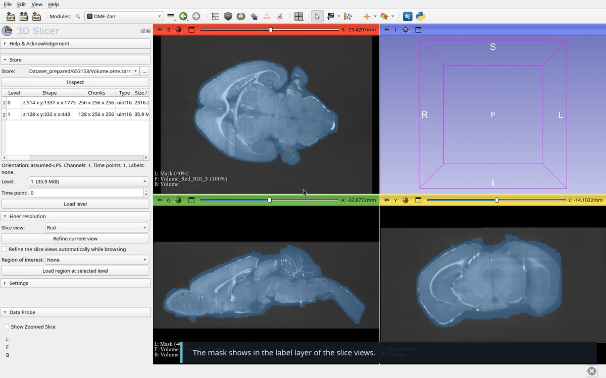
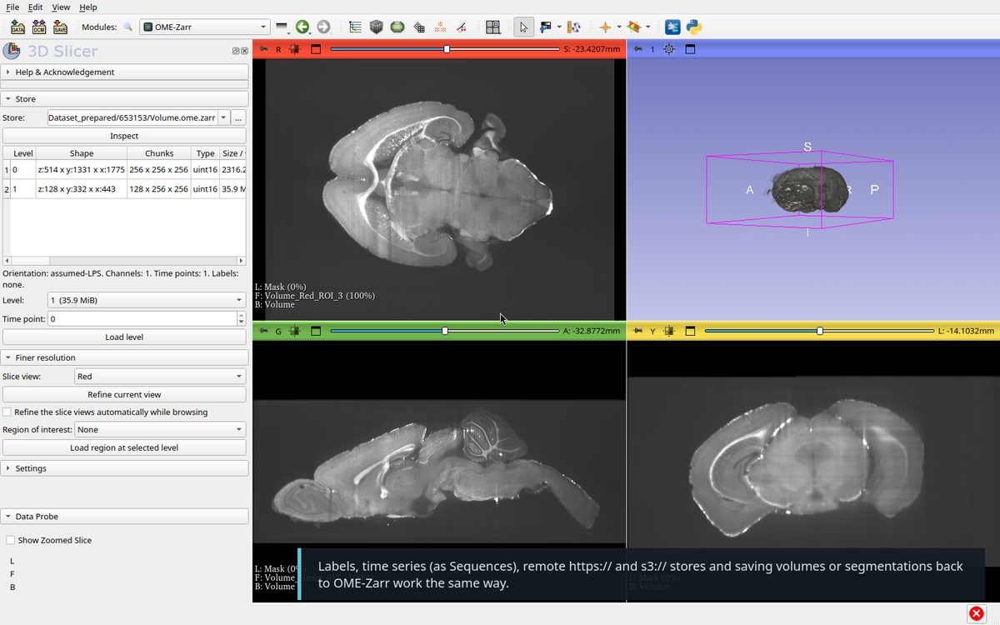
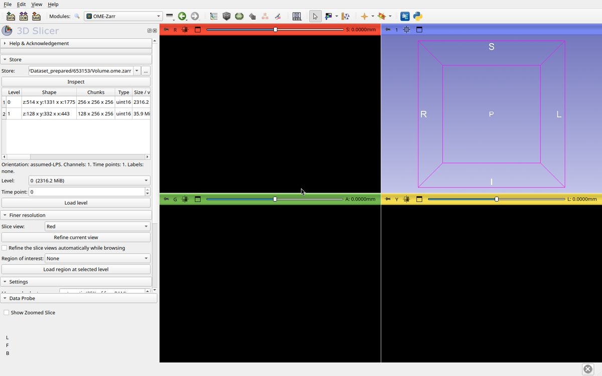

# Walkthrough

Video with captions: [SlicerOMEZarr-tutorial.mp4](Screenshots/SlicerOMEZarr-tutorial.mp4).

Recorded on an ExaSPIM mouse brain (`Volume.ome.zarr`, OME-Zarr 0.4,
1775 × 1331 × 514 voxels at 30.08 × 30.08 × 40 µm, two levels: 2316 MiB and
36 MiB, chunks 256³). The memory budget was set to 512 MiB so that the
coarse level loads first.

1. **Install** the extension. The OME-Zarr module appears under Informatics;
   `ngff-zarr` is installed into Slicer's Python on first use.

2. **Drop** the `.ome.zarr` directory onto the Slicer window and pick
   "Load OME-Zarr image". `File → Add Data` also works with the store's
   `zarr.json` or `.zattrs`.

   

3. **Overview.** The finest level that fits the budget loads, here level 1
   in under a second. Spacing and origin come from the store, in mm. Without
   RFC-4 orientation the axes are taken as LPS (or RAS, in the settings).

   

4. **Inspect** lists the levels, their shape, chunks, size and spacing.

   

5. **Refine.** Zoom a slice view and click "Refine current view": the block
   the view shows is reloaded at the finest level that fits the budget,
   reading only the chunks it needs, and overlaid with the coarse volume's
   window/level. If nothing finer than the displayed level fits, refinement
   is refused: zoom in or raise the budget.

   

6. **Browse.** Tick "Refine automatically": each slice view keeps its own
   block and reloads it once the view stops moving.

   

7. **Masks and labels.** Dropping `Mask.ome.zarr`, a uint8 store with two
   values and no `image-label` metadata, gives a label map. Stores with
   `labels/` groups load with their colours and names, or as Segmentations.

   

8. **Everything else** is ordinary Slicer: volume rendering, segmentation,
   registration. `File → Save` with the "OME-Zarr image" format writes
   volumes, label maps and segmentations back as multiscale stores. Remote
   `https://` and `s3://` stores load the same way; public S3 buckets are
   read anonymously.

   

9. **Settings**: memory budget, assumed orientation, labels, time axis,
   display units, label map detection, remote storage options, auto-refine.

   

From Python:

```python
slicer.util.loadNodeFromFile("/data/653153/Volume.ome.zarr", "OMEZarr", {"level": 1})
from OMEZarr import OMEZarrLogic
OMEZarrLogic.refineView("/data/653153/Volume.ome.zarr", "Red")
OMEZarrLogic.startAutoRefine("/data/653153/Volume.ome.zarr")
```
