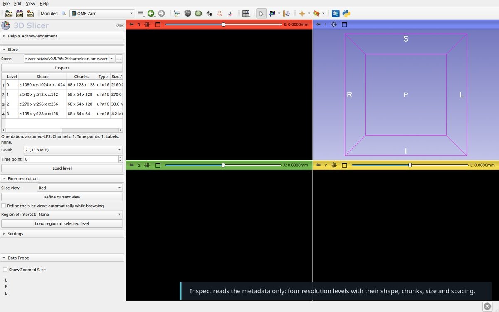
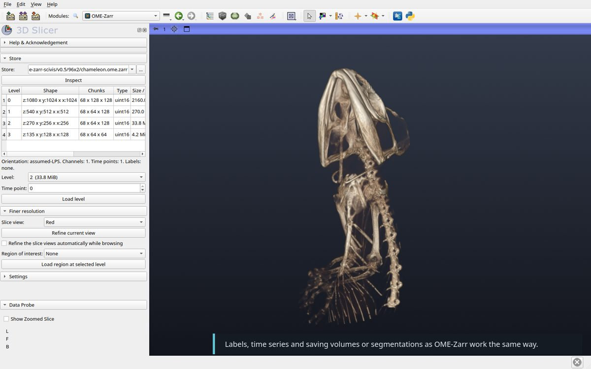
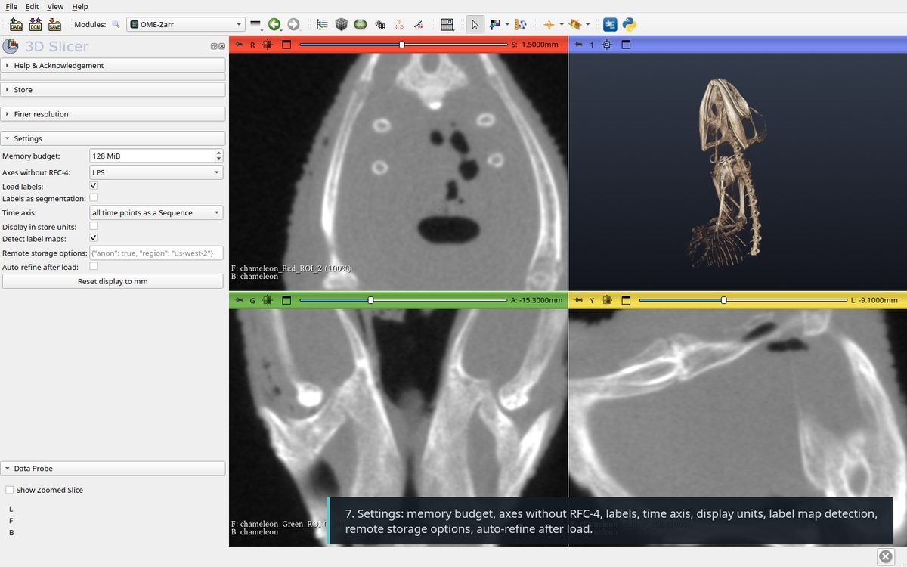

# Walkthrough

Video with captions: [SlicerOMEZarr-tutorial.mp4](Screenshots/SlicerOMEZarr-tutorial.mp4).

Recorded on a public store of the
[OME-Zarr Open SciVis Datasets](https://github.com/InsightSoftwareConsortium/OMEZarrOpenSciVisDatasets),
read straight from `s3://ome-zarr-scivis/v0.5/96x2/chameleon.ome.zarr`: a CT
scan of a chameleon (*Chamaeleo calyptratus*, Digital Morphology, 2003),
OME-Zarr 0.5, 1024 × 1024 × 1080 voxels of 0.092 × 0.092 × 0.105 mm, uint16,
four levels of 2160, 270, 33.8 and 4.2 MiB. The memory budget was set to
128 MiB so that a coarse level loads first. A local `.ome.zarr` directory
works the same way.

1. **Install** the extension. The OME-Zarr module appears under Informatics;
   `ngff-zarr` is installed into Slicer's Python on first use.

   

2. **Open a store.** Paste an `https://` or `s3://` address in the Store field
   and click Inspect. Public S3 buckets are read anonymously when no AWS
   credentials are set. A local store can be chosen in the same field, dropped
   onto the Slicer window ("Load OME-Zarr image"), or added with
   `File → Add Data` through its `zarr.json` or `.zattrs`. Inspect lists the
   levels with their shape, chunks, size and spacing, and preselects the finest
   level that fits the memory budget.

   

3. **Overview.** Load level reads level 2 (33.8 MiB) in a few seconds.
   Spacing and origin come from the store, in mm. Without RFC-4 orientation the
   axes are taken as LPS (or RAS, in the settings). The window was set to
   2000 to 50000 to show bone.

   

4. **Refine.** Zoom a slice view and click "Refine current view": the block
   the view shows is reloaded at the finest level that fits the budget,
   reading only the chunks it needs, and overlaid with the coarse volume's
   window/level. Here the skull in a 30 mm view comes back at level 0,
   326 × 228 × 102 voxels, 14.5 MiB. If nothing finer than the displayed
   level fits, refinement is refused: zoom in or raise the budget.

   

5. **Browse.** Tick "Refine automatically": each slice view keeps its own
   block and reloads it once the view stops moving. The budget is shared
   between the three views.

   

6. **Everything else** is ordinary Slicer: volume rendering, segmentation,
   registration. Stores with `labels/` groups load as label maps or
   Segmentations, time series as Sequences, and `File → Save` with the
   "OME-Zarr image" format writes volumes, label maps and segmentations back
   as multiscale stores.

   

7. **Settings**: memory budget, assumed orientation, labels, time axis,
   display units, label map detection, remote storage options, auto-refine.

   

From Python:

```python
url = "s3://ome-zarr-scivis/v0.5/96x2/chameleon.ome.zarr"
slicer.util.loadNodeFromFile(url, "OMEZarr", {"level": 2})
from OMEZarr import OMEZarrLogic
OMEZarrLogic.refineView(url, "Red")
OMEZarrLogic.startAutoRefine(url)
```
