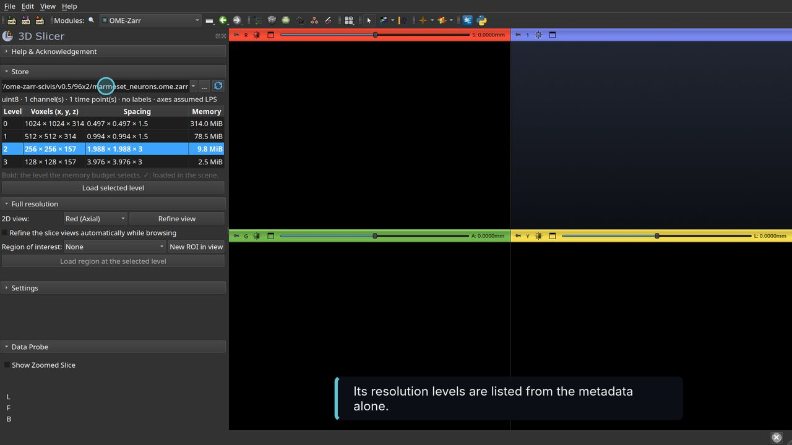
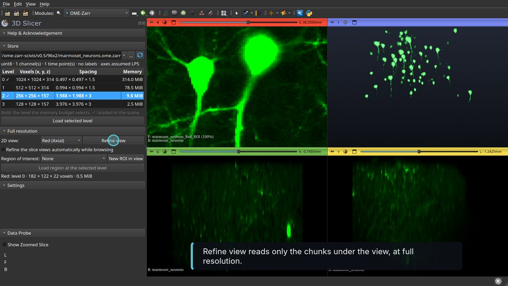
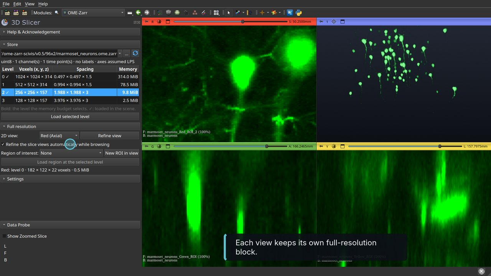
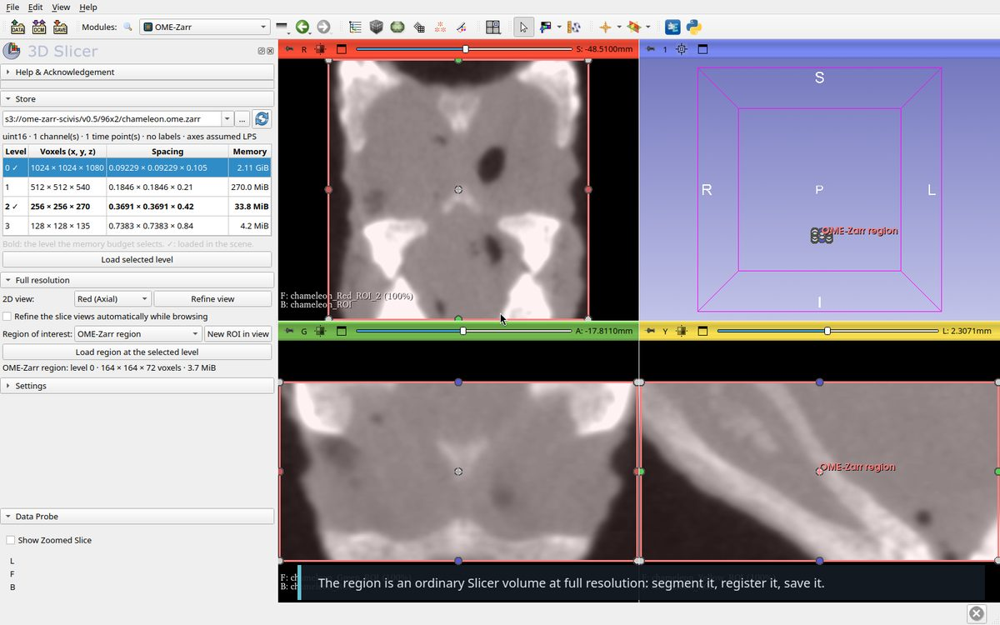
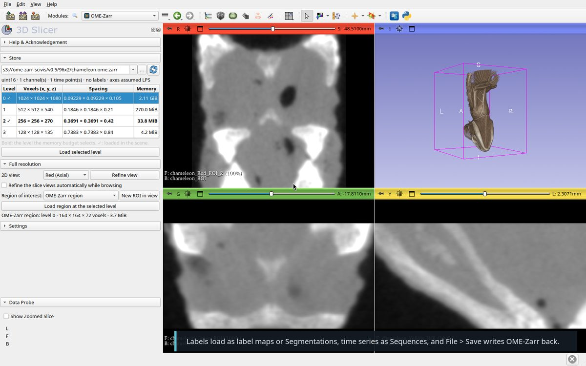
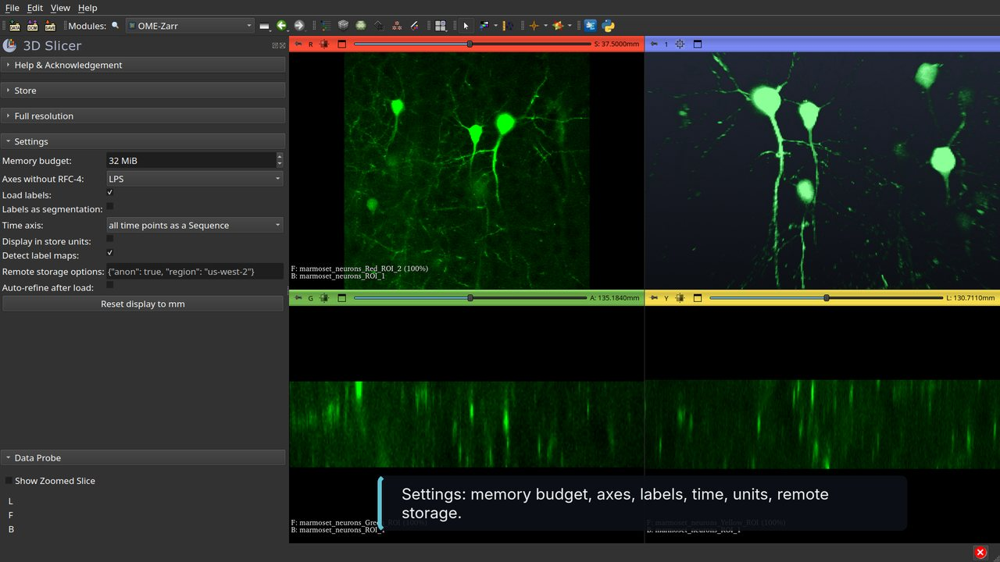

# Walkthrough

Video with captions: [SlicerOMEZarr-tutorial.mp4](Screenshots/SlicerOMEZarr-tutorial.mp4) (1 min).

Recorded on a public store of the
[OME-Zarr Open SciVis Datasets](https://github.com/InsightSoftwareConsortium/OMEZarrOpenSciVisDatasets),
read straight from `s3://ome-zarr-scivis/v0.5/96x2/marmoset_neurons.ome.zarr`:
GFP-labelled pyramidal neurons in the visual cortex of a marmoset, cleared and
imaged on a two-photon microscope (Frederick Federer, Moran Eye Institute,
University of Utah). OME-Zarr 0.5, 1024 × 1024 × 314 voxels of
0.497 × 0.497 × 1.5 µm, uint8, four levels of 314, 78.5, 9.8 and 2.5 MiB. The
store declares no unit, so its micrometres are read as millimetres. The memory
budget was set to 32 MiB so that a coarse level loads first. A local
`.ome.zarr` folder works the same way.

1. **Install** the extension and open the OME-Zarr module (Informatics).
   `ngff-zarr` is installed into Slicer's Python on first use.

   

2. **Open a store.** Paste an `https://` or `s3://` address in the Store
   field, or choose a local folder. The levels are listed right away, with
   their voxels, spacing and memory. The level in bold is the one the memory
   budget selects. S3 is read anonymously unless credentials are given in
   the environment or in the settings. You can also drop a local store onto the Slicer window
   ("Load OME-Zarr image"), or use `File → Add Data` with its `zarr.json` or
   `.zattrs`.

   

3. **Load a level.** "Load selected level" reads level 2 (9.8 MiB) in a few
   seconds; Slicer stays responsive while it reads. Spacing and origin come
   from the store. Loaded levels get a ✓ in the table. Without RFC-4
   orientation the axes are taken as LPS (or RAS, in the settings). The window
   was set to 4 to 140 with the Green colour table, and the 3D view shows a
   maximum intensity projection of the loaded level.

   

4. **Refine a view.** Zoom a 2D view on what you care about, here two neurons,
   pick that view in "2D view" and click "Refine view". The block the view
   shows is read again at the finest level that fits the budget, only the
   chunks it needs, and laid over the coarse volume with the same contrast.
   The panel reports what was loaded (here level 0, about 0.5 MiB). If nothing
   finer than what is displayed fits, the panel tells you to zoom in.

   

5. **Browse.** Tick "Refine the slice views automatically while browsing":
   each 2D view keeps its own block and reloads it when the view stops moving.
   Nothing loads while you pan or zoom, and the budget is shared between the
   three views.

   

6. **Load a region to work on.** Click "New ROI in view": a region of interest
   appears in the middle of the selected view. Drag its handles in the 2D
   views, select a level in the table, and click "Load region at the selected
   level". The result is an ordinary Slicer volume at that resolution, ready
   to segment, register or save (here 496 × 480 × 40 voxels of level 0,
   9.1 MiB).

   

7. **Everything else** is ordinary Slicer, for example volume rendering of the
   region loaded at full resolution. Stores with `labels/` groups load as label
   maps or Segmentations, time series as Sequences, and `File → Save` with the
   "OME-Zarr image" format writes volumes, label maps and segmentations back
   as multiscale stores.

   

8. **Settings**: memory budget, axes without RFC-4, labels, time axis,
   display units, label map detection, remote storage options, auto-refine.

   

From Python:

```python
url = "s3://ome-zarr-scivis/v0.5/96x2/marmoset_neurons.ome.zarr"
slicer.util.loadNodeFromFile(url, "OMEZarr", {"level": 2})
from OMEZarr import OMEZarrLogic
OMEZarrLogic.refineView(url, "Red")
OMEZarrLogic.startAutoRefine(url)
```
